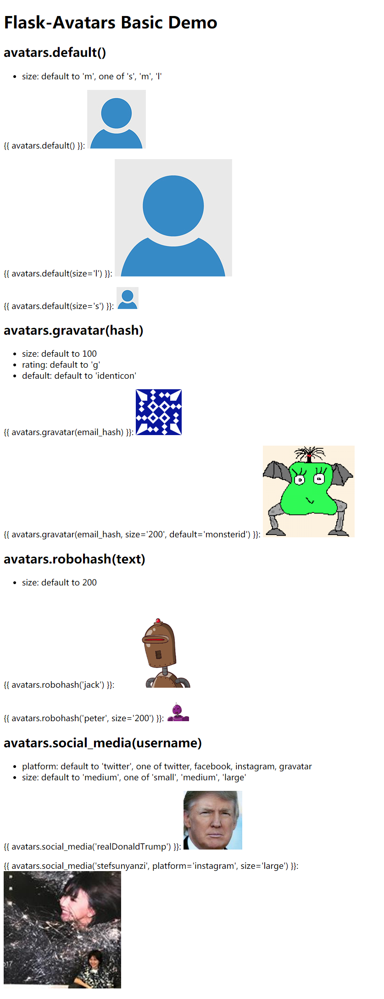
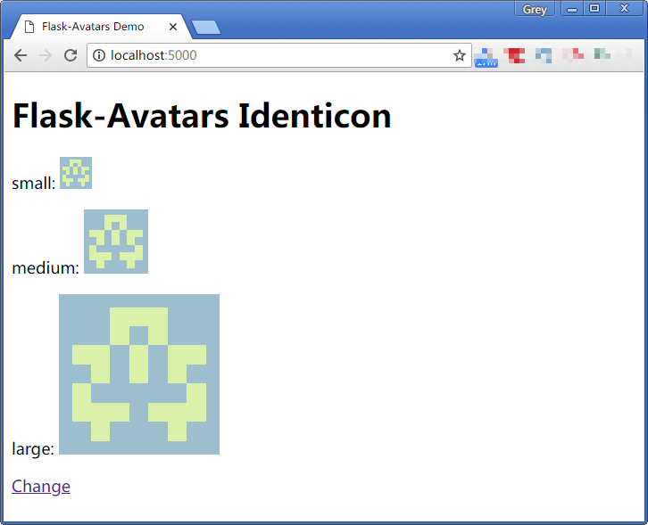
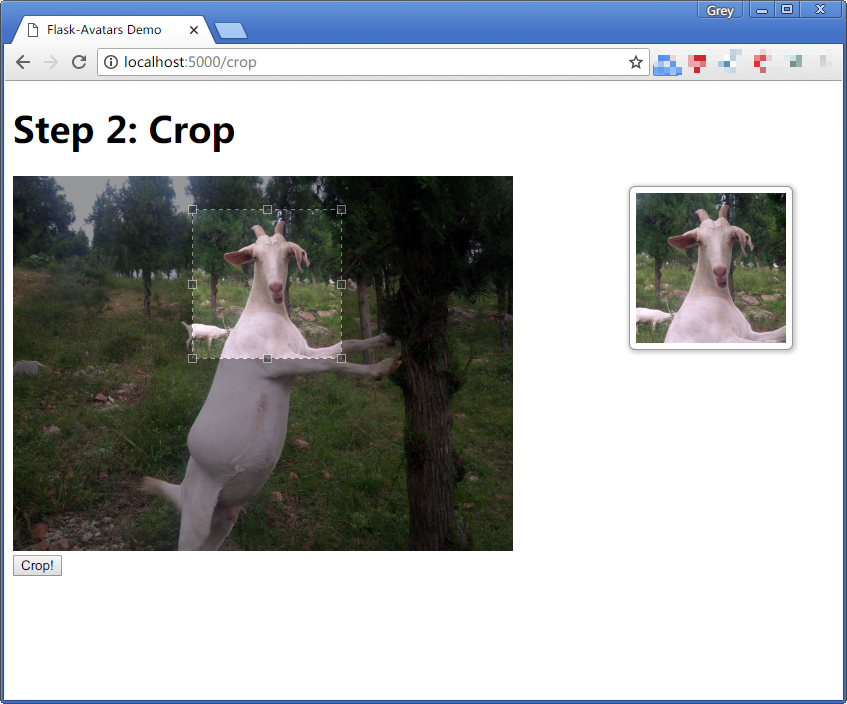
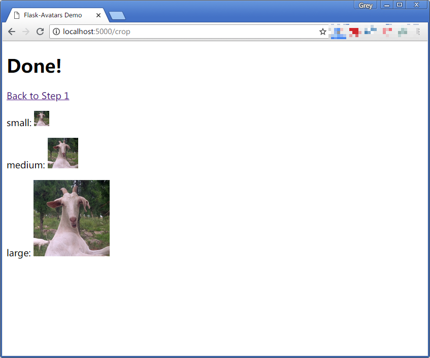

# Flask-Avatars
All avatar generators in one place.

## Installation
```
$ pip install flask-avatars
```

## Initialization
The extension needs to be initialized in the usual way before it can be used:

```python
from flask_avatars import Avatars

app = Flask(__name__)
avatars = Avatars(app)
```


## Configuration

The configuration options available were listed below:

| Configuration | Default Value | Description |
| ------------- | ------------- | ----------- |
| AVATARS_GRAVATAR_DEFAULT | identicon | Gravatar default avatar type |
| AVATARS_SAVE_PATH | `None` | The path where avatar save |
| AVATARS_SIZE_TUPLE | `(30, 60, 150)` | The avatar size tuple in a format of `(small, medium, large)`, used when generate identicon avatar |
| AVATARS_IDENTICON_COLS | 7 | The cols of identicon avatar block |
| AVATARS_IDENTICON_ROWS | 7 | The ros of identicon avatar block |
| AVATARS_IDENTICON_BG | `None` | The back ground color of identicaon avatar, pass RGB tuple (for example `(125, 125, 125)`). Default (`None`) to use random color |
| AVATARS_CROP_BASE_WIDTH |	500 | The display width of crop image
| AVATARS_CROP_INIT_POS	| (0, 0) | The initial position of cop box, a tuple of (x, y), default to left top corner
| AVATARS_CROP_INIT_SIZE | None	| The initial size of crop box, default to `AVATARS_SIZE_TUPLE[0]`
| AVATARS_CROP_MIN_SIZE	| None | The min size of crop box, default to no limit
| AVATARS_CROP_PREVIEW_SIZE	| None | The size of preview box, default to `AVATARS_SIZE_TUPLE[1]`
| AVATARS_SERVE_LOCAL | False | Load Jcrop resources from local (built-in), default to use CDN


## Avatars

Flask-Avatars provide a `avatars` object in template context, you can use
it to get avatar URL.

### Gravatar

You can use `avatars.gravatar()` to get an avatar URL provided by
[Gravatar](https://en.gravatar.com/site/implement/images/), pass the email
hash:
```html

```
You can get email hash like this:
```py
import hashlib

avatar_hash = hashlib.md5(my_email.lower().encode('utf-8')).hexdigest()
```

### Robohash

[Robohash](https://robohash.org) provide random robot avatar, you can use
`avatars.robohash()` to get the avatar URL, pass a random text:
```html

```

### Social Media Avatar by Avatars.io

[Avatars.io](https://avatars.io) let you use your social media's avatar
(Twitter, Facebook or Instagram), you can use `avatars.social_media()`
to get the avatar URL, pass your username on target social media:

```html

```
Default to use Twitter, use `platform` to change it:
```html

```

### Default Avatar

Flask-Avatars provide a default avatar with three size, use `avatars.default()`
to get the URL:
```html

```
You can use `size` to change size (one of `s`, `m` and `l`), for example:
```html

```

### Identicon Generatation
Flask-Avatars provide a `Identicon` class to generate [identicon](https://www.wikiwand.com/en/Identicon)
avatar, most of the code was based on [randomavatar](https://pypi.org/project/randomavatar/).
First, you need set configuration variable `AVATARS_SAVE_PATH` to tell
Flask-Avatars the path to save generated avatars. Generally speaking, we
will generate avavar when the user record was created, so the best place to
generate avatar is in user database model class:
```py
class User(db.Model):
    avatar_s = db.Column(db.String(64))
    avatar_m = db.Column(db.String(64))
    avatar_l = db.Column(db.String(64))

    def __init__():
        generate_avatar()

    def generate_avatar(self):
        avatar = Identicon()
        filenames = avatar.generate(text=self.username)
        self.avatar_s = filenames[0]
        self.avatar_m = filenames[1]
        self.avatar_l = filenames[2]
        db.session.commit()
```

Then create a view to serve avatar image like this:
```py
from flask import send_form_directory, current_app

@app.route('/avatars/<path:filename>')
def get_avatar(filename):
    return send_from_directory(current_app.config['AVATARS_SAVE_PATH'], filename)
```

## Avatar Crop
Flask-Avatars add support avatar crop based on [Jcrop](https://github.com/tapmodo/Jcrop).

### Step 1: Upload
The first step is to let user upload the raw image, so we need to create a
form in HTML.
**upload.html**
```html
<form method="post" enctype="multipart/form-data">
    <input type="file" name="file">
    <input type="submit">
</form>
```
If you use Flask-WTF, you can create a form like this:
```py
from flask_wtf.file import FileField, FileAllowed, FileRequired

class UploadAvatarForm(FlaskForm):
    image = FileField('Upload (<=3M)', validators=[
        FileRequired(),
        FileAllowed(['jpg', 'png'], 'The file format should be .jpg or .png.')
    ])
    submit = SubmitField()
```
When the user click the submit button, we save the file with `avatars.save_avatar()`:
```py
app.config['AVATARS_SAVE_PATH'] = os.path.join(basedir, 'avatars')

# serve avatar image
@app.route('/avatars/<path:filename>')
def get_avatar(filename):
    return send_from_directory(app.config['AVATARS_SAVE_PATH'], filename)


@app.route('/', methods=['GET', 'POST'])
def upload():
    if request.method == 'POST':
        f = request.files.get('file')
        raw_filename = avatars.save_avatar(f)
        session['raw_filename'] = raw_filename  # you will need to store this filename in database in reality
        return redirect(url_for('crop'))
    return render_template('upload.html')
```

### Step 2: Crop

Now we create a crop route to render crop page:
```py
@app.route('/crop', methods=['GET', 'POST'])
def crop():
    if request.method == 'POST':
        ...
    return render_template('crop.html')
```

Here is the content of crop.html:
**crop.html**
```html
<head>
    <meta charset="UTF-8">
    <title>Flask-Avatars Demo</title>
    {{ avatars.jcrop_css() }}  <!-- include jcrop css -->
    <style>
        #preview-box {
            ... /* some css to make a better preview window */
        }
    </style>
</head>
<body>
<h1>Step 2: Crop</h1>
{{ avatars.crop_box('get_avatar', session['raw_filename']) }}  <!-- crop window -->
{{ avatars.preview_box('get_avatar', session['raw_filename']) }}  <!-- preview widow -->
<form method="post">
    <input type="hidden" id="x" name="x">
    <input type="hidden" id="y" name="y">
    <input type="hidden" id="w" name="w">
    <input type="hidden" id="h" name="h">
    <input type="submit" value="Crop!">
</form>
{{ avatars.jcrop_js() }}  <!-- include jcrop javascript -->
{{ avatars.init_jcrop() }}  <!-- init jcrop -->
</body>
```
Note the form we created to save crop position data, the four input's name and id must be
`x`, `y`, `w`, `h`.

If you use Flask-WTF/WTForms, you can create a form class like this:
```python
class CropAvatarForm(FlaskForm):
    x = HiddenField()
    y = HiddenField()
    w = HiddenField()
    h = HiddenField()
    submit = SubmitField('Crop')
```

### Step 3: Save
When the use click the crop button, we can handle the real crop work behind the
screen:
```py
@app.route('/crop', methods=['GET', 'POST'])
def crop():
    if request.method == 'POST':
        x = request.form.get('x')
        y = request.form.get('y')
        w = request.form.get('w')
        h = request.form.get('h')
        filenames = avatars.crop_avatar(session['raw_filename'], x, y, w, h)
        url_s = url_for('get_avatar', filename=filenames[0])
        url_m = url_for('get_avatar', filename=filenames[1])
        url_l = url_for('get_avatar', filename=filenames[2])
        return render_template('done.html', url_s=url_s, url_m=url_m, url_l=url_l)
    return render_template('crop.html')
```

`avatars.crop_avatar()` return the crop files name in a tuple `(filename_s, filename_m, filename_;)`,
you may need to store it in database.

## Example Applications

Currently, we have three examples:
* examples/basic
* examples/identicon
* examples/crop

You can run the example applications in this way:
```
$ git clone https://github.com/greyli/flask-avatars.git
$ cd flask-avatars/examples
$ pip install flask flask-avatars
$ cd basic
$ flask run
```
If you are busy, here are some screenshots of the examples:









## TODO
- [ ] Fix English grammar error at everywhere :(


## ChangeLog

### 0.1.1

Release date: 2018/7/21

* Add three example applications.
* `avatars.jcrop_js()` now default to include jQuery (`with_jquery=True`).

### 0.1.0

Release date: 2018/6/19

Initialize release.

## License

This project is licensed under the MIT License (see the
`LICENSE` file for details).
