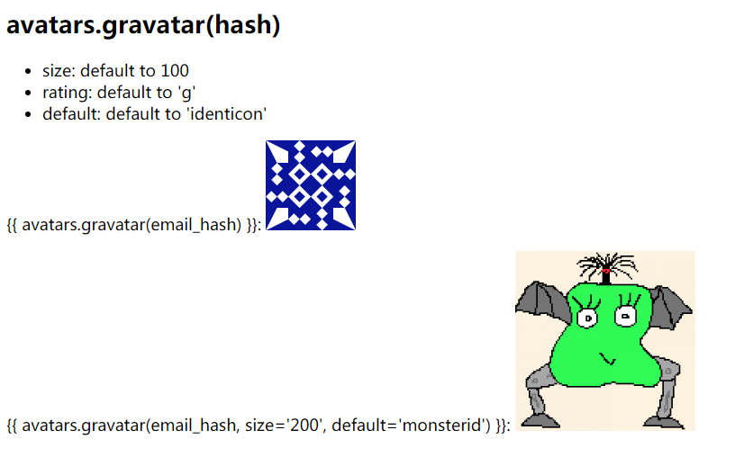
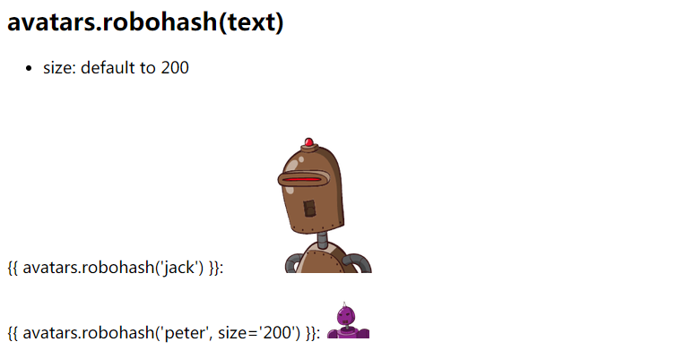
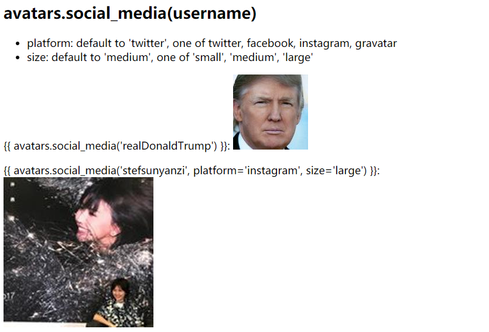
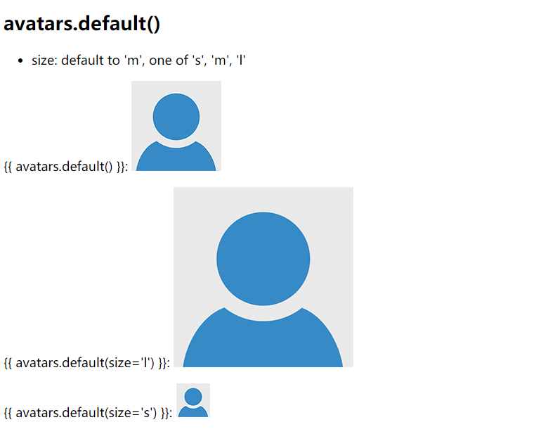

Flask-Avatars
=============

All avatar generators in one place.

Installation
------------

.. code-block:: bash

    $ pip install flask-avatars

Initialization
--------------

The extension needs to be initialized in the usual way before it can be
used:

.. code-block:: python

   from flask_avatars import Avatars

   app = Flask(__name__)
   avatars = Avatars(app)

Configuration
-------------

The configuration options available were listed below:

+------------------------+------------------------+--------------------+
| Configuration          | Default Value          | Description        |
+========================+========================+====================+
| AVATARS_GRAVATAR_DEFAU | identicon              | Gravatar default   |
| LT                     |                        | avatar type        |
+------------------------+------------------------+--------------------+
| AVATARS_SAVE_PATH      | ``None``               | The path where     |
|                        |                        | avatar save        |
+------------------------+------------------------+--------------------+
| AVATARS_SIZE_TUPLE     | ``(30, 60, 150)``      | The avatar size    |
|                        |                        | tuple in a format  |
|                        |                        | of                 |
|                        |                        | ``(small, medium,  |
|                        |                        | large)``,          |
|                        |                        | used when generate |
|                        |                        | identicon avatar   |
+------------------------+------------------------+--------------------+
| AVATARS_IDENTICON_COLS | 7                      | The cols of        |
|                        |                        | identicon avatar   |
|                        |                        | block              |
+------------------------+------------------------+--------------------+
| AVATARS_IDENTICON_ROWS | 7                      | The ros of         |
|                        |                        | identicon avatar   |
|                        |                        | block              |
+------------------------+------------------------+--------------------+
| AVATARS_IDENTICON_BG   | ``None``               | The back ground    |
|                        |                        | color of           |
|                        |                        | identicaon avatar, |
|                        |                        | pass RGB tuple     |
|                        |                        | (for example       |
|                        |                        | ``(125, 125, 125)` |
|                        |                        | `).                |
|                        |                        | Default (``None``) |
|                        |                        | to use random      |
|                        |                        | color              |
+------------------------+------------------------+--------------------+
| AVATARS_CROP_BASE_WIDT | 500                    | The display width  |
| H                      |                        | of crop image      |
+------------------------+------------------------+--------------------+
| AVATARS_CROP_INIT_POS  | (0, 0)                 | The initial        |
|                        |                        | position of cop    |
|                        |                        | box, a tuple of    |
|                        |                        | (x, y), default to |
|                        |                        | left top corner    |
+------------------------+------------------------+--------------------+
| AVATARS_CROP_INIT_SIZE | None                   | The initial size   |
|                        |                        | of crop box,       |
|                        |                        | default to         |
|                        |                        | ``AVATARS_SIZE_TUP |
|                        |                        | LE[0]``            |
+------------------------+------------------------+--------------------+
| AVATARS_CROP_MIN_SIZE  | None                   | The min size of    |
|                        |                        | crop box, default  |
|                        |                        | to no limit        |
+------------------------+------------------------+--------------------+
| AVATARS_CROP_PREVIEW_S | None                   | The size of        |
| IZE                    |                        | preview box,       |
|                        |                        | default to         |
|                        |                        | ``AVATARS_SIZE_TUP |
|                        |                        | LE[1]``            |
+------------------------+------------------------+--------------------+
| AVATARS_SERVE_LOCAL    | False                  | Load Jcrop         |
|                        |                        | resources from     |
|                        |                        | local (built-in),  |
|                        |                        | default to use CDN |
+------------------------+------------------------+--------------------+

Avatars
-------

Flask-Avatars provide a ``avatars`` object in template context, you can
use it to get avatar URL.

Gravatar
~~~~~~~~

You can use ``avatars.gravatar()`` to get an avatar URL provided by
`Gravatar`_, pass the email hash:

.. code-block:: html

   

You can get email hash like this:

.. code-block:: python

   import hashlib

   avatar_hash = hashlib.md5(my_email.lower().encode('utf-8')).hexdigest()

Robohash
~~~~~~~~

`Robohash`_ provide random robot avatar, you can use
``avatars.robohash()`` to get the avatar URL, pass a random text:

.. code-block:: html

   

Social Media Avatar by Avatars.io
~~~~~~~~~~~~~~~~~~~~~~~~~~~~~~~~~

`Avatars.io`_ let you use your social media’s avatar (Twitter, Facebook
or Instagram), you can use ``avatars.social_media()`` to get the avatar
URL, pass your username on target social media:

.. code-block:: html

   

Default to use Twitter, use ``platform`` to change it:

.. code-block:: html

   

Default Avatar
~~~~~~~~~~~~~~

Flask-Avatars provide a default avatar with three size, use
``avatars.default()`` to get the URL:

.. code-block:: html

   

You can use ``size`` to change size (one of ``s``, ``m`` and ``l``), for
example:

.. code-block:: html

   

Identicon Generatation
~~~~~~~~~~~~~~~~~~~~~~

Flask-Avatars provide a ``Identicon`` class to generate `identicon <https://www.wikiwand.com/en/Identicon>`_
avatar, most of the code was based on `randomavatar <https://pypi.org/project/randomavatar/>`_. First, you need
set configuration variable ``AVATARS_SAVE_PATH`` to tell Flask-Avatars
the path to save generated avatars. Generally speaking, we will generate
avavar when the user record was created, so the best place to generate
avatar is in user database model class:

.. code-block:: python

   class User(db.Model):
       avatar_s = db.Column(db.String(64))
       avatar_m = db.Column(db.String(64))
       avatar_l = db.Column(db.String(64))

       def __init__():
           generate_avatar()

       def generate_avatar(self):
           avatar = Identicon()
           filenames = avatar.generate(text=self.username)
           self.avatar_s = filenames[0]
           self.avatar_m = filenames[1]
           self.avatar_l = filenames[2]
           db.session.commit()

Then create a view to serve avatar image like this:

.. code-block:: python

   from flask import send_form_directory, current_app

   @app.route('/avatars/<path:filename>')
   def get_avatar(filename):
       return send_from_directory(current_app.config['AVATARS_SAVE_PATH'], filename)

.. image:: ../screenshots/identicon.png
   :alt: identicon demo

Avatar Crop
-----------

Flask-Avatars add support avatar crop based on `Jcrop <https://github.com/tapmodo/Jcrop>`_.

Step 1: Upload
~~~~~~~~~~~~~~

The first step is to let user upload the raw image, so we need to create
a form in HTML. **upload.html**

.. code-block:: html

   <form method="post" enctype="multipart/form-data">
       <input type="file" name="file">
       <input type="submit">
   </form>

If you use Flask-WTF, you can create a form like this:

.. code-block:: python

   from flask_wtf.file import FileField, FileAllowed, FileRequired

   class UploadAvatarForm(FlaskForm):
       image = FileField('Upload (<=3M)', validators=[
           FileRequired(),
           FileAllowed(['jpg', 'png'], 'The file format should be .jpg or .png.')
       ])
       submit = SubmitField()

When the user click the submit button, we save the file with
``avatars.save_avatar()``:

.. code-block:: python

   app.config['AVATARS_SAVE_PATH'] = os.path.join(basedir, 'avatars')

   # serve avatar image
   @app.route('/avatars/<path:filename>')
   def get_avatar(filename):
       return send_from_directory(app.config['AVATARS_SAVE_PATH'], filename)

   @app.route('/', methods=['GET', 'POST'])
   def upload():
       if request.method == 'POST':
           f = request.files.get('file')
           raw_filename = avatars.save_avatar(f)
           session['raw_filename'] = raw_filename  # you will need to store this filename in database in reality
           return redirect(url_for('crop'))
       return render_template('upload.html')

Step 2: Crop
~~~~~~~~~~~~

Now we create a crop route to render crop page:

.. code-block:: python

   @app.route('/crop', methods=['GET', 'POST'])
   def crop():
       if request.method == 'POST':
           ...
       return render_template('crop.html')

Here is the content of crop.html:

.. code-block:: html

    <head>
        <meta charset="UTF-8">
        <title>Flask-Avatars Demo</title>
        {{ avatars.jcrop_css() }}  <!-- include jcrop css -->
        
    </head>
    <body>
        <h1>Step 2: Crop</h1>
        {{ avatars.crop_box('get_avatar', session['raw_filename']) }}  <!-- crop window -->
        {{ avatars.preview_box('get_avatar', session['raw_filename']) }}  <!-- preview widow -->
        <form method="post">
            <input type="hidden" id="x" name="x">
            <input type="hidden" id="y" name="y">
            <input type="hidden" id="w" name="w">
            <input type="hidden" id="h" name="h">
            <input type="submit" value="Crop!">
        </form>
        {{ avatars.jcrop_js() }}  <!-- include jcrop javascript -->
        {{ avatars.init_jcrop() }}  <!-- init jcrop -->
    </body>

Note the form we created to save crop position data, the four input’s
name and id must be ``x``, ``y``, ``w``, ``h``.

If you use Flask-WTF/WTForms, you can create a form class like this:

.. code-block:: python

   class CropAvatarForm(FlaskForm):
       x = HiddenField()
       y = HiddenField()
       w = HiddenField()
       h = HiddenField()
       submit = SubmitField('Crop')

.. image:: ../screenshots/crop.png
   :alt: Crop

Step 3: Save
~~~~~~~~~~~~

When the use click the crop button, we can handle the real crop work
behind the screen:

.. code-block:: python

   @app.route('/crop', methods=['GET', 'POST'])
   def crop():
       if request.method == 'POST':
           x = request.form.get('x')
           y = request.form.get('y')
           w = request.form.get('w')
           h = request.form.get('h')
           filenames = avatars.crop_avatar(session['raw_filename'], x, y, w, h)
           url_s = url_for('get_avatar', filename=filenames[0])
           url_m = url_for('get_avatar', filename=filenames[1])
           url_l = url_for('get_avatar', filename=filenames[2])
           return render_template('done.html', url_s=url_s, url_m=url_m, url_l=url_l)
       return render_template('crop.html')

``avatars.crop_avatar()`` return the crop files name in a tuple
``(filename_s, filename_m, filename_l)``, you may need to store it in database.

.. image:: ../screenshots/cropped.png
   :alt: Crop Done

Example Applications
--------------------

Currently, we have three examples:

* examples/basic
* examples/identicon
* examples/crop

You can run the example applications in this way::

   $ git clone https://github.com/greyli/flask-avatars.git
   $ cd flask-avatars/examples
   $ pip install flask flask-avatars
   $ cd basic
   $ flask run

.. _Gravatar: https://en.gravatar.com/site/implement/images/
.. _Robohash: https://robohash.org
.. _Avatars.io: https://avatars.io

Development
-----------

We welcome all kinds of contributions. You can run test like this:

.. code-block:: bash

    $ python setup.py test

Authors
-------

Maintainer: `Grey Li <http://greyli.com>`_

See also the list of
`contributors <https://github.com/greyli/flask-avatars/contributors>`_
who participated in this project.

License
-------

This project is licensed under the MIT License (see the
``LICENSE`` file for details).

.. _api:

API
---

.. module:: flask_avatars

Avatars object in template
~~~~~~~~~~~~~~~~~~~~~~~~~~~

.. autoclass:: _Avatars
   :members: gravatar, default, robohash, social_media, jcrop_css, jcrop_js, init_jcrop, crop_box, preview_box

Avatars object in Python
~~~~~~~~~~~~~~~~~~~~~~~~~

.. autoclass:: Avatars
   :members: resize_avatar, save_avatar, crop_avatar, gravatar, default, robohash, social_media

Identicon
~~~~~~~~~~

.. module:: flask_avatars.identicon

.. autoclass:: Identicon
   :members: __init__, generate

.. include:: ../CHANGES.rst
